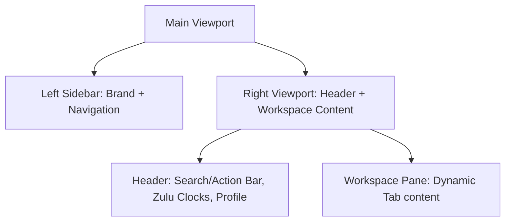

# SkyDeck Design Specification

This document details the styling architecture, visual design tokens, typography, and interactive component layouts implemented for the SkyDeck Electronic Flight Bag (EFB) platform, as configured in [StyleTest.tsx](/src/StyleTest.tsx).

---

## 1. Global Reset & Base Typography

The design system incorporates the styling resets and smoothing models of `Cal.com` combined with clean, high-readability typography.

```css
html, body, #main {
  box-sizing: border-box;
  margin: 0;
  padding: 0;
}

:root {
  -webkit-font-smoothing: antialiased;
  -moz-osx-font-smoothing: grayscale;
}

* {
  box-sizing: border-box !important;
  -webkit-font-smoothing: inherit !important;
}

body, input, textarea, select, button {
  font-family: 'Poppins', sans-serif !important;
}
```

* **Poppins Font Family:** Imported from Google Fonts, used globally to provide a clean, modern, and highly legible interface for dense aviation data.
* **12px Base Scaling:** Set on inputs, selects, body copy, and button triggers to facilitate a compact, high-density, professional EFB (Electronic Flight Bag) layout.
* **Font Smoothing:** Applied globally to ensure crisp text rendering across all platforms, enhancing readability in critical flight information displays.

### 1.1 Typography Scale
Try to use a consistent typographic scale for headings, body text, and UI elements. Using mainly the variables existing in the design system.

---

## 2. Design System Tokens (Color Palette)

All color tokens map directly to the hex values defined in the design system:

| Variable Token | Color Value | Description / Element Mapping |
| :--- | :--- | :--- |
| `brand` | `#6349ea` | **Brand Purple** (Primary accents, active page states, primary CTA button) |
| `card` | `#ffffff` | **Card Background** (Sidebar, top navigation bar, cards, modules) |
| `workspace` | `#f4f4f4` | **Main Workspace Background** (Page canvas background) |
| `input` | `#fcfcfc` | **Extra Light Gray** (Inputs background, HUD sub-panels) |
| `primary-border` | `#e1e2e3` | **Primary Border** (Outer layout borders, tab dividers, input borders) |
| `soft-border` | `#e5e7eb` | **Soft Border** (Inside dividers, secondary borders) |
| `main-text` | `#374151` | **Main Text** (Body paragraphs, labels, secondary headings) |
| `dark-text` | `#242424` | **Dark Text** (Brand title, main page headings, select details) |
| `muted` | `#898989` | **Muted Text** (Subtitle tags, timestamps, breadcrumbs) |

### Functional Status Indicators
Colors variables such as theme success, error and info should be only used when really needed, as the design system is primarily monochromatic with a single accent color.

---

## 3. Structural Layout Grid
The workspace utilizes an asymmetric sidebar-header flex layout.



### Layout Elements
1. **Left Sidebar:** Width is fixed (`w-68`), borders are `border-r border-cal-main`, background is `bg-cal-card`. Controls the primary navigation state.
2. **Top Header:** Height is fixed (`h-16`), background is `bg-cal-card`, border is `border-b border-cal-main`. Hosts global filters, local/UTC clocks, and profile data.
3. **Workspace Pane:** Flex-expanded container (`flex-1`) with scroll properties, hosting the tabbed dashboards.

---